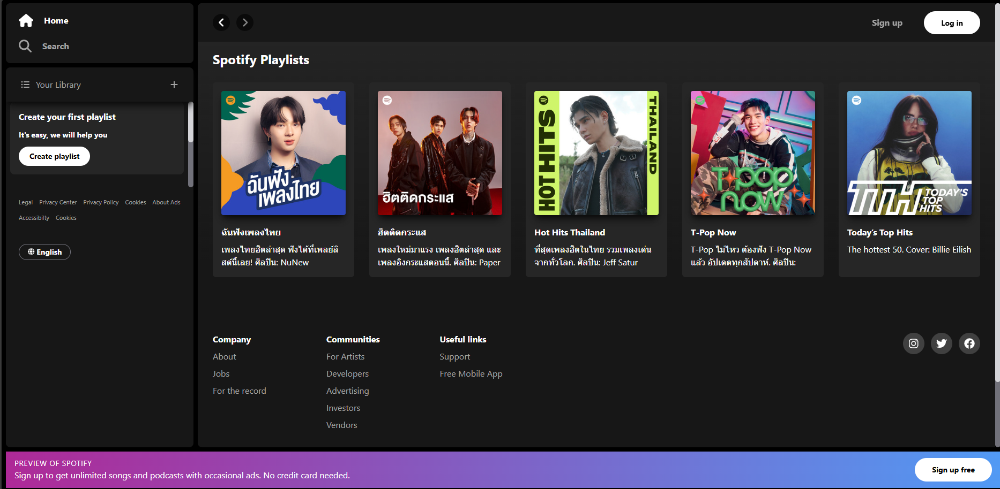

# REACT SPOTIFY ⚛️
Demo: [https://aef-nattanon.github.io/react-spotify-clone/](https://aef-nattanon.github.io/react-spotify-clone/)

Clone of the [Spotify Web Player](https://open.spotify.com/) using **React** & **TailwindCSS**.

## How to install
### Clone repo

```cmd
git clone https://github.com/aef-nattanon/react-spotify-clone.git
```

### Install dependencies

```cmd
yarn install
# or
npm install
```

### Run the project

- add the `.env` file using the provided `.env.template`

```env
VITE_API_CLIENT_ID=**you spotify client id**
VITE_API_CLIENT_SECRET=**you spotify client secret**
```


- start project
```cmd
yarn run dev
# or
npm run dev
```




## API

Spotify's [Web API](https://developer.spotify.com/documentation/web-api) allows the development of applications that can interact with Spotify's streaming service. This includes retrieving content metadata, obtaining recommendations, creating and managing playlists, and controlling playback.

## TECH STACK

- [**React**](https://react.dev/) & [React router](https://reactrouter.com/en/main)
- [**TailwindCSS**](https://tailwindcss.com/)
